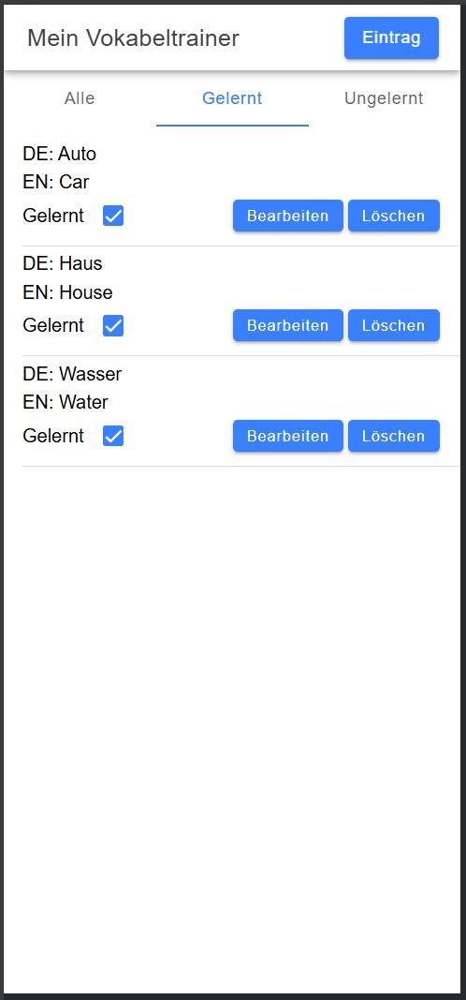

# Meine Vokabeltrainer

A mobile vocabulary trainer built with **Ionic7 + Angular17**, helping users study and manage their German-English vocabulary.

Use browser devtools mobile simulation and live page https://arthurkorchak.github.io/meine-vokabeltrainer/

   

---

## Features

- Add, edit, and delete German–English vocabulary
- Mark words as learned
- Stores data in browser/device `localStorage`
- Uses NGXS for reactive state management
- Jest-based unit tests

---

### Installation

Make sure you have **Node.js**, **npm**, **Ionic CLI**, and **Angular CLI** installed:

```bash
npm install
```

### Run

To run application use:

```bash
npm run start
```

### Tests

To run application testsuse:

```bash
npm run tests
```
